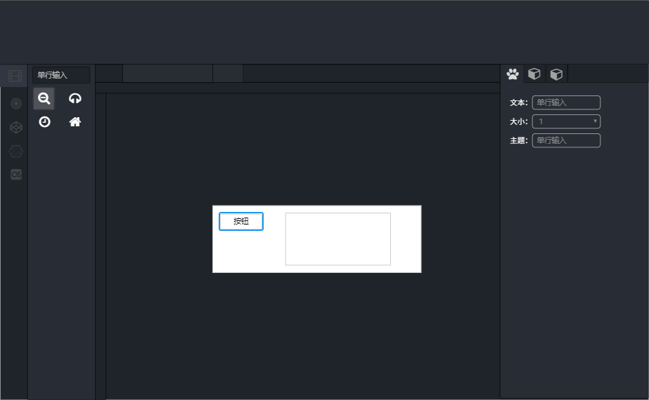
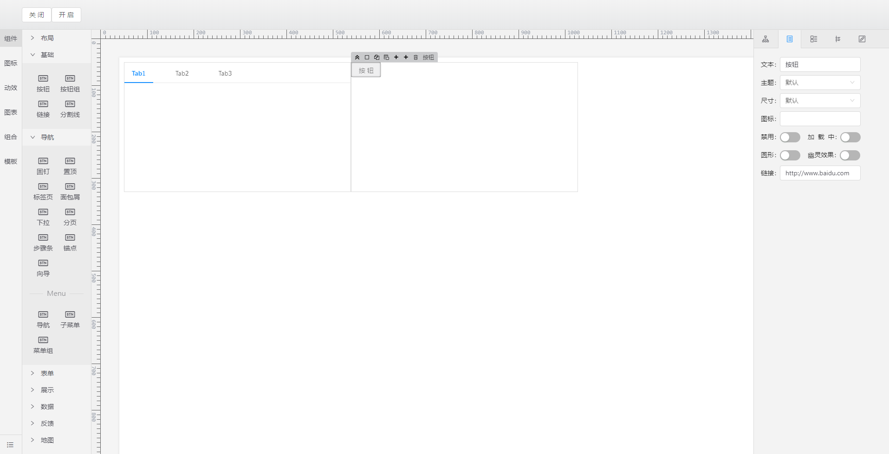
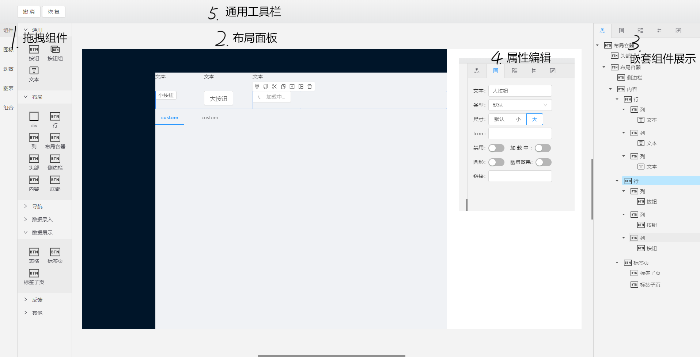
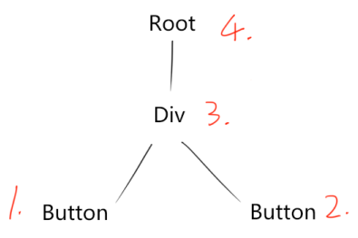
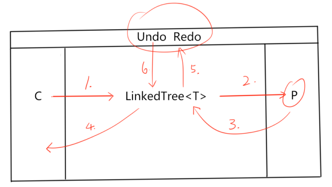

## 1. 背景
&emsp;&emsp;目前公司的核心业务主要以做项目为主，当下前端技术发展飞速，但是公司前端技术整体主要还是以沉淀的 **Jquery** 以及相关配套技术为主。个人在做项目的过程中积极引入 **MVVM** 的相关技术，先后尝试 **Avalon、React、Vue** 等时下流行的技术框架积极尝试能快速开发的工作链路。<br/>
&emsp;&emsp;个人是后端出身，对 .Net平台下的 winform, wpf, silverlight 有所涉及，所以想到能否有一个 GUI 的编辑器来支持整个页面的拖拽式的开发。在网上找到了很多参考案例，但是这些都是<span style="color:#009">针对特定的应用并且以模板的形式呈现</span>，而定制化的项目中粒度是以**组件**和**Html元素**，所以就就设想了这样一个页面编辑器。<br/>
&emsp;&emsp;编辑器相对于常见的业务开发显得比较复杂，原始的代码组织方式从项目组织和开发体验上都有巨大缺憾，需要扩展新的技术寻求突破。借助 React + Typescript 能很好的将后端的开发精髓引入到前端，将复杂的功能模块化及组织，带来开发和迭代的极大便利。<br/>


## 2. 准备工作
### 2.1 技术选型
- 平台：Node / [Electron](https://electronjs.org/)
- 界面：Typescript / React / [Umi](https://github.com/umijs/umi) / [Antd](https://ant.design/index-cn)
- 交互：[AntM](https://motion.ant.design/) / [React-dnd](https://github.com/react-dnd/react-dnd) / [Monaco-editor](https://microsoft.github.io/monaco-editor/)
- 数据库：IndexDB / [Dexie](https://dexie.org/)

&emsp;&emsp;选择 React + Typescript 主要是因为这套前端技术组合可以让我无缝的接入后端沉淀的面向对象编程思维（和后端的语言如 C#, Java 的特性十分贴近），其他技术已提供相应官网链接，若不了解请查看官网详细说明。

### 2.2 原型设计、准备静态资源
- 图标库 Iconfont（自己挑选符合功能点的 Icon）
- 工具：Axure、墨刀

&emsp;&emsp;主要用来勾勒各个模块的布局和功能点的分布：
<br/><br/>

### 2.3 功能清单
- 项目入口
    - 新建项目
    - 编辑项目信息
- 编辑器
    - 多页编辑
    - 拖拽模块
        - Html元素
        - Antd组件
        - 图标库
        - 其他
    - 布局模块
        - 布局标尺
        - 拖拽布局
        - 布局编辑
        - 树形数据
    - 编辑模块
        - 属性编辑
        - 样式编辑
        - 事件编辑
        - 动效编辑
    - 模板模块
        - 组合组件
        - 组合模板
    - 变量模块
    - 动效模块
        - 页面动效
    - 代码模块
        - 项目模板
        - 代码生成
    - 素材模块
        - 素材管理
        - 素材打包


## 3.开发
### 3.1 设计目录结构
目录结构主要分为两大块：
1. main 主要提供 本地IO 、Electron 的操作接口、应用生命周期的钩子
2. renderer 主要用来渲染编辑器、数据库操作


源码目录结构大致如下：

```
|—— main
    |—— config
    |—— services
    |—— utils
    |—— renderer
|—— renderer
    |—— src
        |——database
        |——utils
        |—— ...
```


- config：存放配置文件
- services：存放供 renderer 调用的接口
- utils：通用的工具类库
- renderer：子目录主要是由 Umi 脚手架生成
- database：主要存放**实体类**以及**数据库操作类**
- utils：主语存放**通用数据结构**和工具类库
- [完整目录](https://github.com/Lanzz1994/LzzUIEditorForElectron)，基于 [umi-example-electron](https://github.com/umijs/umi-example-electron) 改造，架构出处请查看参考链接

### 参考
- https://github.com/sorrycc/blog/issues/13

### 3.2 代码设计
&emsp;&emsp;应用主要涉及三个板块，界面、后台、数据库。<br/>
&emsp;&emsp;设计之初功能想的太多，精力有限目前只实现了 **拖拽模块、布局模块、编辑模块**，目前只能展示阶段性成果，这个项目会持续更新，希望能把这个项目做成一个好的学习素材，这三个模块也是编辑器里比较有代表性的模块。

#### 3.2.1 以下列出实现的关键点，我将结合代码说明这些关键点的体现：

- 数据结构
    - 链表 - LinkedList
    - 树 - Tree
    - 树链表 - LinkedTree
    - Map
    - 队列
- 算法
    - 递归
- 设计模式
    - 命令模式
    - 工厂模式
    - 观察者模式
    - 单例模式

#### 3.2.2  功能图解
- 早期版本



- 现在版本



- 拖拽组件
    - 提供组件库拖拽
- 布局面板
    - 提供组件布局、编辑、组件组合、建立模板等功能
- 树形展示
    - 提供组件嵌套展示，拖拽排序，选中，经过组件等
- 属性编辑
    - 提供组件属性编辑
- 通用工具栏
    - 提供通用工具，撤销、恢复

#### 参考
- https://www.jianshu.com/p/840e0b0b2c6a
- https://www.codercto.com/a/18841.html
    - 注意阅读**应用上层设计**一节

### 3.2.3 设计思路

- 从**界面交互**转向**数据交互**

    从代码层面，复杂的交互本质就是数据间的交互，中间的逻辑实现可以看作搬运角色。从数据交互的角度观察和设计，能更容易也更准确地实现所需的功能。这个应用的核心就是**对数据进行读取、渲染、编辑、持久化以及根据数据生成指定内容**。

- 用**泛型**解决结构化问题

    开发过程会到许多相似的、有规律可循的内容，需要对齐抽象封装，将固定和变化解耦隔离。依赖数据结构 **LinkedTree&lt;T&gt;** 实现组件布局、重排等功能。
    

### 3.3 实现原理
- ### 数据结构：<a href="#">LinkedTree&lt;T&gt;</a>
    
    LinkedTree 是一个嵌套链表结构，数据格式如下：<br/>
    ```javascript
    //纯净格式
    let treedata={
        Data:{},
        Children:[
            { Data:{},Children:[] },
            { Data:{},Children:[] }
        ]
    };

    //布局组件
    let parttree={
        Data:{
            Key:'Div',
            Props:{
                Style:{
                    Width:100,
                    Height:100
                }
            }
        },
        Children:[
            { 
                Data:{
                    Key:'Button',
                    Props:{
                        Text:'按钮1',
                        Type:'default'
                        Size:'small',
                    }
                },
                Children:[]
            },
            { 
                Data:{
                    Key:'Button',
                    Props:{
                        Text:'按钮2',
                        Type:'default'
                        Size:'default',
                    }
                },
                Children:[]
            }
        ]
    };
    ```
- ### 数据解析原理
    - 每个组件都有自己唯一的标识 Key，<br/>如 Html.Button, Antd.Button
    - 递归算法每次从一个节点的最左边的子节点开始遍历，依次遍历兄弟节点，父节点。如下图：

    
    <br/>
    每次遍历完一行兄弟节点，就会把该行的集合返回给父节点，以便由父节点包裹。比如：1，2 遍历完后，会得到一个数组 [ Button , Button ]，遍历到 3 时就可以得到子节点集合，这样就能知道 Div 下有两个 Button。最后由根节点进行处理，就能得到整颗组件树。

- ### 工作流程图解

```javascript
//组件库
let components={
    Antd:{
        Button:{
            //组件信息
        }
    },
    Html:{
        Div:{
            //组件信息
        }
    },
    Template:{
        //组合组件集合
    }
};

//布局面板
let layout={
    Data:{ Name:'Root' },
    Children:[] //布局面板还没有任何组件
};

//当前选中、拖拽、经过的节点
let selectedNode=null,
    dragNode=null,
    hoverNode=null;

//属性面板
let props={};

//撤销、恢复队列
let undoRedos={
    undos:[],
    redos:[]
}
```
  1. 从组件库拖拽组件，将组件放置布局面板
        ```
        1.开始拖拽：获得目前拖拽的组件信息以便在布局面板加载
        2.拖拽经过：选择要放置在哪个数据节点下
        3.拖拽放置：将数据添加到指定的数据节点里
        ```
        ```javascript
        //各步骤下对应数据变化
        // 1.获得组件信息
        dragNode={
            Data:{
                Key:'Html.Div',
                Name:'Div',
                Props:{
                    Style:{
                        Width:'100%',
                        Height:200
                    }
                }
            },
            Children:[]
        };

        // 2.经过指定节点
        hoverNode={
            Data:{ Name:'Root' },
            Children:[]
        }

        // 3.放置拖拽节点，指定节点添加子节点
        hoverNode.addNode(dragNode);
        
        //布局数据变为
        layout={
            Data:{ Name:'Root' },
            Children:[
                Data:{
                    Key:'Html.Div',
                    Name:'Div',
                    Props:{
                        Style:{
                            Width:'100%',
                            Height:200
                        }
                    }
                },
                Children:[]
                }
            ]
        }
        ```
  2. 选择组件，加载组件参数
        ```
        1.经过：选择要编辑的组件
        2.选中：获得目前选中组件的参数加载到属性面板
        ```
        ```javascript
        // 2.选中
        selectedNode={
            Data:{
                Key:'Html.Div',
                Name:'Div', 
                Props:{
                    Style:{
                        Width:'100%',
                        Height:200
                    },
                    title:'这是一个div'
                }
            },
            Children:[]
        };

        // 属性面板拿到 selectedNode.Data.Props 加载属性编辑器
        // ClassName, Style 有对应的样式编辑器
        // 其他属性在 属性编辑面板操作
        props={
            Style:{
                Width:'100%',
                Height:200
            }
        }
        ```
  3. 更新组件参数，更新布局
        ```
        1.编辑属性：编辑组件指定的属性
        2.更新到指定的数据节点：组件的参数变化布局需要重新渲染
        ```
        ```javascript
        // 1.编辑属性、样式
        props.title='编辑div的title属性';
        props.Style.Width='50%';

        // 2.根据属性面板更新的数据 更新layout上的数据，重新渲染
        // 更新布局数据前要先把当前的数据添加到撤销队列
        undoRedos.undos.push(layout);
        layout={
            Data:{ Name:'Root' },
            Children:[
                {
                    Data:{
                        Key:'Html.Div',
                        Name:'Div',
                        Props:{
                            Style:{
                                Width:'50%',//change
                                Height:200
                            },
                            title:'编辑div的title属性'//change
                        }
                    },
                    Children:[]
                }
            ]
        }
        ```

  4. 建立组合组件，提供下次拖拽
        ```
        1.添加组合组件：将该节点的布局数据保存到数据库，下次即可组件库中拖拽
        ```
        ```javascript
        // 1.添加组合组件，下次拖拽即可直接得到布局数据
        components.Template["NewAssembly"]={
            Data:{
                Key:'Div',
                Props:{
                    Style:{
                        Width:100,
                        Height:100
                    }
                }
            },
            Children:[
                { 
                    Data:{
                        Key:'Button',
                        Props:{
                            Text:'按钮1',
                            Type:'default'
                            Size:'small',
                        }
                    },
                    Children:[]
                },
                { 
                    Data:{
                        Key:'Button',
                        Props:{
                            Text:'按钮2',
                            Type:'default'
                            Size:'default',
                        }
                    },
                    Children:[]
                }
            ]
        };
        ```
  5. 布局内容更新触发撤销，恢复
        ```
        1.更新历史纪录队列：更新之前将目前的布局数据加入队列
        ```
        ```javascript

        // 1. 撤销队列
        // 取出并删除撤销队列最后一个布局数据
        let temp=undoRedos.undos.pop();
        // 附加到恢复队列
        undoRedos.redos.push(temp);
        // 更新布局数据
        layout=temp;
        ```
  6. 撤销、恢复更新布局内容
        ```
        1.拿到布局数据重新渲染布局
        ```
        ```javascript
        // 1. 恢复
        let temp=undoRedos.redos.pop();
        undoRedos.undos.push(temp);
        layout=temp;
        ```

### 参考
- 撤销恢复功能参考
- https://blog.csdn.net/turbochen/article/details/8087
- https://blog.csdn.net/zouliping123/article/details/8249196
- https://blog.csdn.net/Mrzhang0419/article/details/52217463